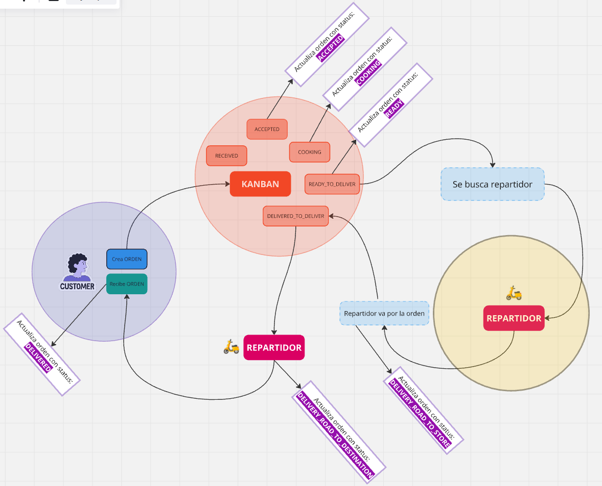

## Ciclo de vida de una orden

### **Estatus de una ORDEN**    
| Estatus de orden             | Descripción cuando orcurre                                 |
|:-----------------------------|:-----------------------------------------------------------|
| ORDERED                      | Estatus inicial(creación)                                  |
| ACCEPTED                     | Cuando el restaurante acepta la orden                      |
| COOKING                      | Cuando el restaurante lo está preparando                   |
| READY                        | Cuando la orden ya está lista                              |
| DELIVERY_ROAD_TO_STORE       | Cuando el repartido va por el pedido al retaurante         |
| DELIVERY_ROAD_TO_DESTINATION | Cuando el repartidor ya va a entregar el pedido al usuario |
| DELIVERED                    | Cuando el pedido ya fué entregado                          |
| CANCELLED                    | Cuando el pedido es cancelado por el usuario               |

### **Estatus de KANBAN de un restaurante**
| Estatus de Kanban    | Descripción cuando orcurre | Acciones secundarios                      |
|:---------------------|:---------------------------|:------------------------------------------|
| RECEIVED             | Orden recibida             | n/a                                       |
| ACCEPTED             | Orden aceptada             | La **ORDEN** pasa a estatus  **ACCEPTED** |
| COOKING              | Preparando orden           | La **ORDEN** pasa a estatus  **COOKING**  |                                          |
| READY_TO_DELIVER     | Listo para entregar        | Busca repartidor                          |
| DELIVERED_TO_DELIVER | Entregado a repartido      | n/a                                       |   

