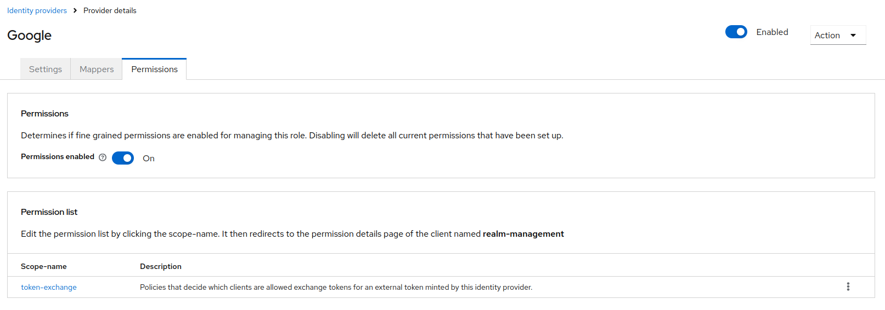
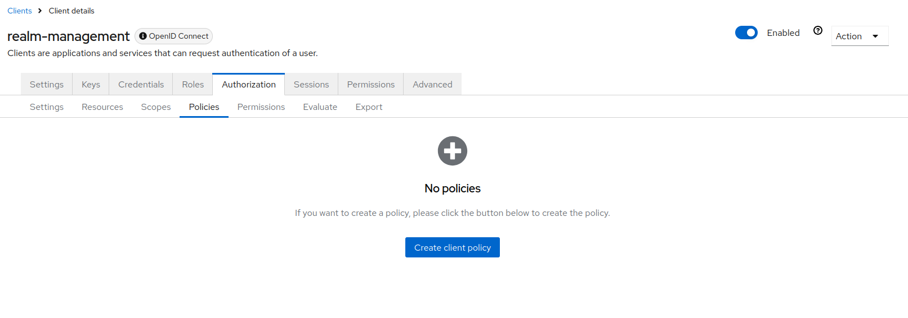
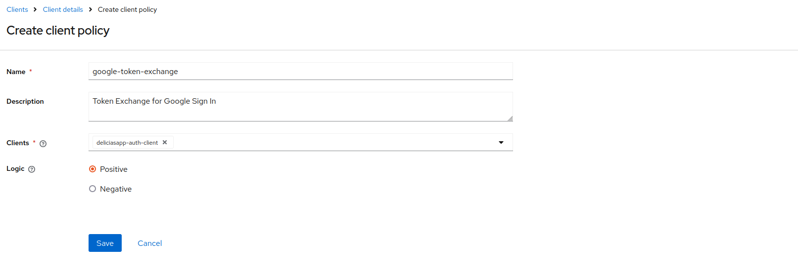
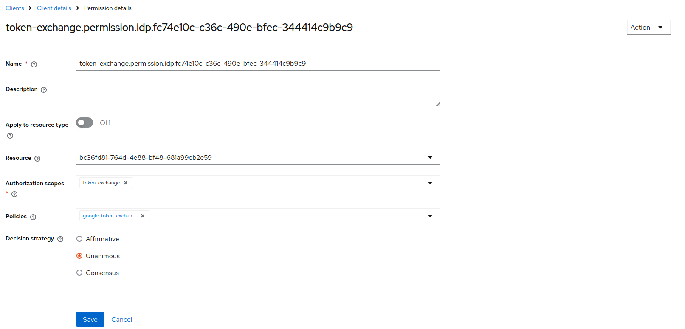
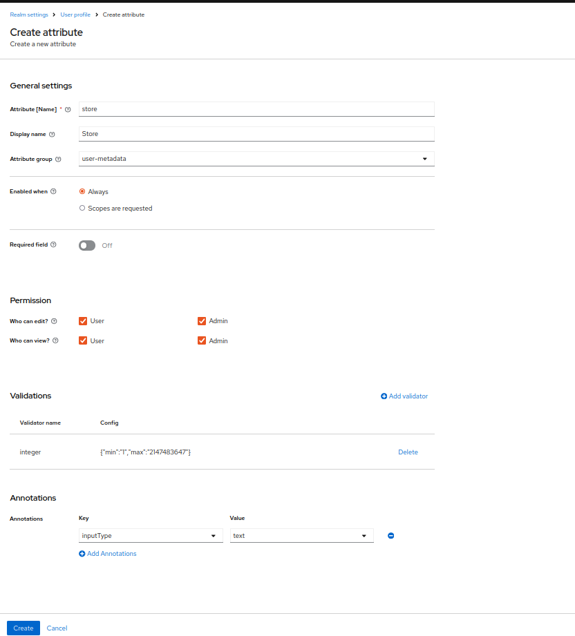
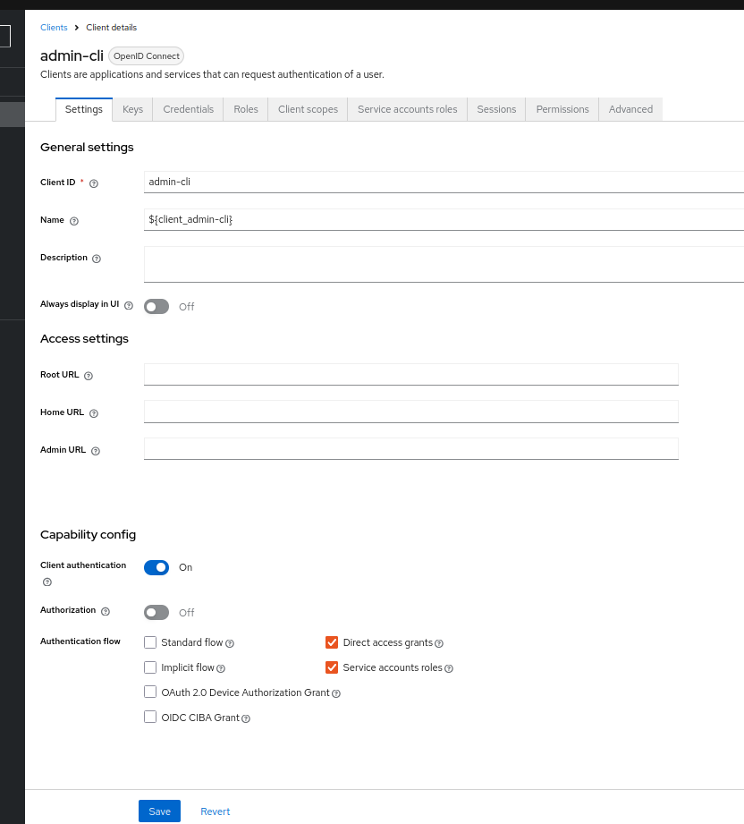
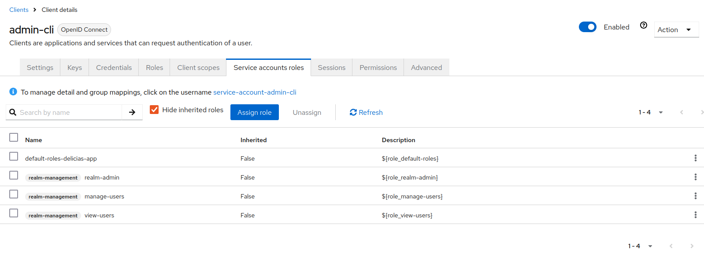

## Keycloak


### Ver logs
```
sudo journalctl -u keycloak.service -f
```


### Enabling features
```
sudo ./bin/kc.sh build --features="token-exchange,admin-fine-grained-authz"
```
Add in /opt/keycloak/conf/keycloak.conf
```
features=token-exchange,admin-fine-grained-authz
```

### Google exchange config
##### Add Google Identity Provider


##### List policies


##### Create policy


##### Token Exchange Set Policy


[Google OAuth2 API v2](https://developers.google.com/oauthplayground/)

### Token Exchange
```
curl --location 'http://192.168.101.4:9001/realms/delicias-app/protocol/openid-connect/token' \
--header 'Content-Type: application/x-www-form-urlencoded' \
--data-urlencode 'grant_type=urn:ietf:params:oauth:grant-type:token-exchange' \
--data-urlencode 'subject_token_type=urn:ietf:params:oauth:token-type:access_token' \
--data-urlencode 'client_id=deliciasapp-auth-client' \
--data-urlencode 'subject_token=ya29.a0AXooCgvdh_hBNft-3bXmZxtp6fMbsRApMrKbIxwL-S8kY8Y-HY4Z54lra6xK0AmuPWwRstGR4nwuXBuTlTqmNxUIQbBl5Y7sF4Asvfve917lrSfVFhm7zDlpX8lkN_vOMR0Gtn8OOuH_LDGa4M7Wl7c7e7Y9WlZo_yt5aCgYKAeISARISFQHGX2MitqKdIM6cm38glcy4x942qQ0171' \
--data-urlencode 'subject_issuer=google'
```

### Add Store Attribute

##### Token Exchange Set Policy



### admin-cli
General Settings



Roles



After copy Credentials Client Secret 
## Elastic Search

### Show sha256
```
cd /opt/elastic/elasticsearch-8.14.3/config/certs
```
```
openssl x509 -fingerprint -sha256 -noout -in http_ca.crt
```

## Apache Kafka

```
bin/zookeeper-server-start.sh config/zookeeper.properties
```

```
bin/kafka-server-start.sh config/server.properties
```

```
bin/kafka-topics.sh --create --topic order --bootstrap-server localhost:9092 --partitions 1 --replication-factor 1
```

```
bin/kafka-console-producer.sh --topic test --bootstrap-server localhost:9092
```

```
bin/kafka-console-consumer.sh --topic test --from-beginning --bootstrap-server localhost:9092
```